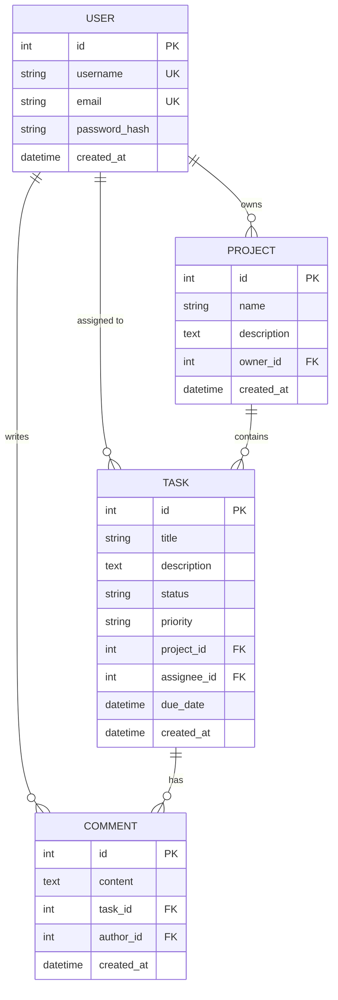

# Database Design Documentation

## Domain

**Task Management System** — users own projects, projects contain tasks,
tasks are assigned to users and can be discussed via comments.

## Entities (4, related)

| Entity  | Description                                   |
|---------|------------------------------------------------|
| User    | An account that owns projects, is assigned tasks, and writes comments |
| Project | A container for tasks, owned by exactly one user |
| Task    | A unit of work belonging to a project, optionally assigned to a user |
| Comment | A note left by a user on a task               |

## ER Diagram

## Relationships

- **User → Project** (1:N): a user owns many projects. `Project.owner_id`
  is a required FK to `User.id` with `ON DELETE CASCADE` — deleting a user
  deletes their projects.
- **Project → Task** (1:N): a project has many tasks. `Task.project_id`
  is required, `ON DELETE CASCADE` — deleting a project deletes its tasks.
- **User → Task** (1:N, optional): a user may be assigned many tasks.
  `Task.assignee_id` is nullable, `ON DELETE SET NULL` — deleting a user
  un-assigns (rather than deletes) their tasks.
- **Task → Comment** (1:N): a task has many comments. `Comment.task_id`
  is required, `ON DELETE CASCADE`.
- **User → Comment** (1:N): a user writes many comments. `Comment.author_id`
  is required, `ON DELETE CASCADE`.

## Constraints

- `User.username`, `User.email` — unique.
- `Project(owner_id, name)` — unique together (a user cannot have two
  projects with the same name).
- `Task.status` — check constraint, one of `todo | in_progress | done | cancelled`.
- `Task.priority` — check constraint, one of `low | medium | high | urgent`.
- Foreign keys enforce referential integrity as described above.

## Transactions

- **Flask**: `db.session.commit()` / `db.session.rollback()` around
  multi-row operations, e.g. `TaskService.bulk_update_status`.
- **FastAPI**: the equivalent async pattern using `AsyncSession.commit()` /
  `rollback()`, e.g. `TaskService.bulk_update_status` (async version).

Both implementations use SQLAlchemy's unit-of-work pattern: a request that
fails partway through a multi-step write rolls back cleanly rather than
leaving partial state.
